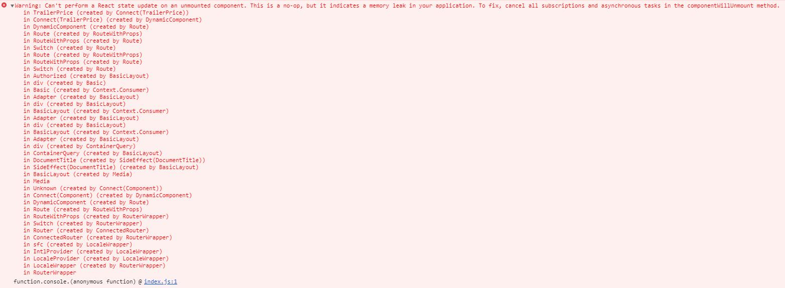
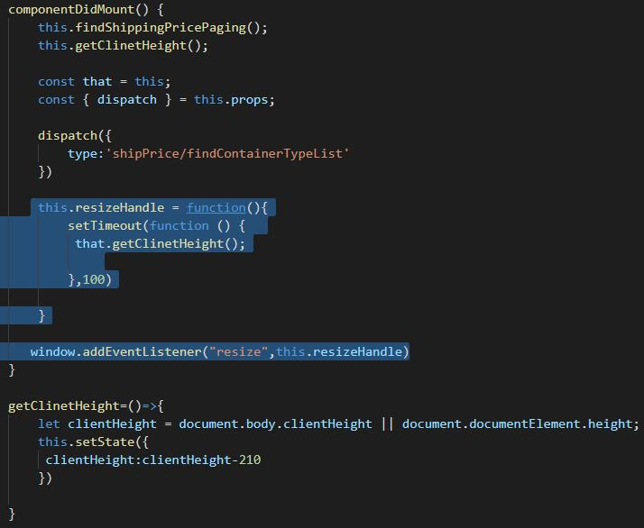
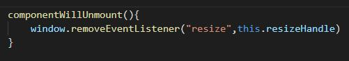
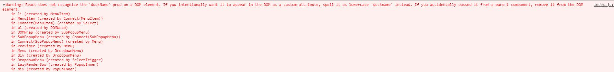

# React开发遇见常见问题汇总

很多时候，时间久，很多事情记不清了,本篇博客主要记录我自己在react项目开发遇到问题，方便自己回顾，也给刚从事react开发新手提供参考，少走些弯路。

* React报错信息：Warning: Can't perform a React state update on an unmounted component. This is a no-op, but it indicates a memory leak in your application. To fix, cancel all subscriptions and asynchronous tasks in the componentWillUnmount method.

上面报错大概意思是：我们不能在组件销毁后操作state，这是一个禁忌，容易出现内存泄漏的情况，若要修复，请取消组件中的所有订阅和异步任务

报错信息截图

我写代码

分析出现问题的原因

我这里在组件加载完成的钩子函数里监听了resize事件，函数节流调用getClinetHeight方法中操作了state更新。

解决方法
在componentWillMount钩子函数移除事件监听

* React报错信息：index.js:1 Warning: React does not recognize the `dockName` prop on a DOM element. If you intentionally want it to appear in the DOM as a custom attribute, spell it as lowercase `dockname` instead. If you accidentally passed it from a parent component, remove it from the DOM element.

中文翻译：react无法识别dom元素上的“dockname”属性。如果您有意希望它作为自定义属性出现在DOM中，请将其拼写为小写的“dockname”。如果不小心从父组件传递了它，请将其从dom元素中移除。

报错信息截图

解决方法
dom元素上属性'dockName'名称改成小写'dockname'

* 基于umijs搭建React项目，在windows下打包正常，在linux打包异常(文件名或文件夹未区分大小写)。

原因：由于windows系统目录和文件不区分大小写，linux系统区分目录和文件大小写，router.config.js中配置 component: './BusinessManagement/ExecutoryCosts'，其中路径为'BusinessManagement/executoryCosts.js',导致在linux中打包，找不到文件，打包失败。

解决方案：文件名及文件要区分大小写，不然会出现在在windows下打包正常，在linux打包找不到文件。
