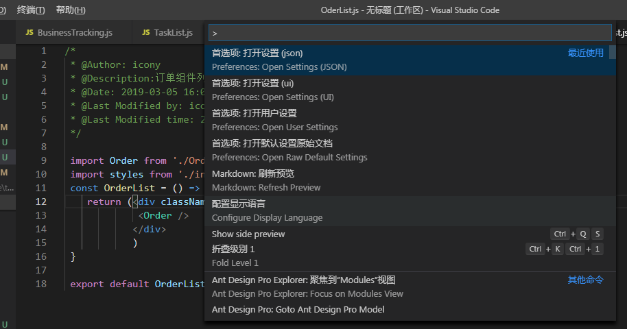
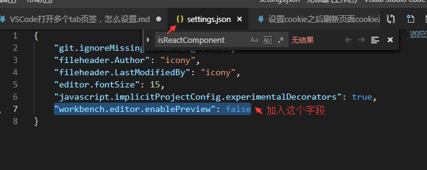
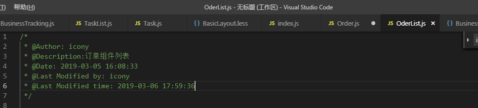

# VSCode打开多个tab页签，怎么设置？

在使用vscode过程过中，vscode默认只打开一个页签，后打开覆盖前一个页面，开发过程很不方便，怎么打开多个页签呢？  

1、在window系统下，ctrl + shift + p 命令,输入setting关键字,打开面板

  

2、点击首选项，打开settings.json配置文件,添加下图标记配置项

3、保存settings.json配置文件，就可以打开多个页签，可以愉快工作了

